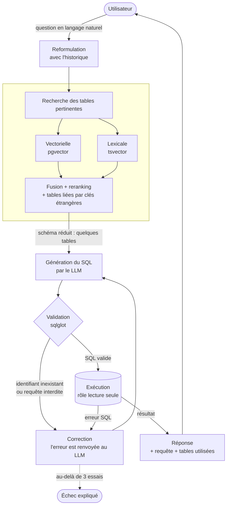

```mermaid
flowchart TD
    U([Utilisateur]) -->|question en langage naturel| RW[Reformulation<br/>avec l'historique]

    RW --> RET[Recherche des tables pertinentes]

    subgraph RETRIEVAL [ ]
        direction LR
        RET --> D[Vectorielle<br/>pgvector]
        RET --> L[Lexicale<br/>tsvector]
        D --> FU[Fusion + reranking<br/>+ tables liées par clés étrangères]
        L --> FU
    end

    FU -->|schéma réduit : quelques tables| GEN[Génération du SQL<br/>par le LLM]

    GEN --> VAL{Validation<br/>sqlglot}
    VAL -->|identifiant inexistant<br/>ou requête interdite| REP[Correction<br/>l'erreur est renvoyée au LLM]
    REP --> GEN

    VAL -->|SQL valide| EXE[(Exécution<br/>rôle lecture seule)]
    EXE -->|erreur SQL| REP
    EXE -->|résultat| ANS[Réponse<br/>+ requête + tables utilisées]
    ANS --> U

    REP -.->|au-delà de 3 essais| FAIL([Échec expliqué])
```