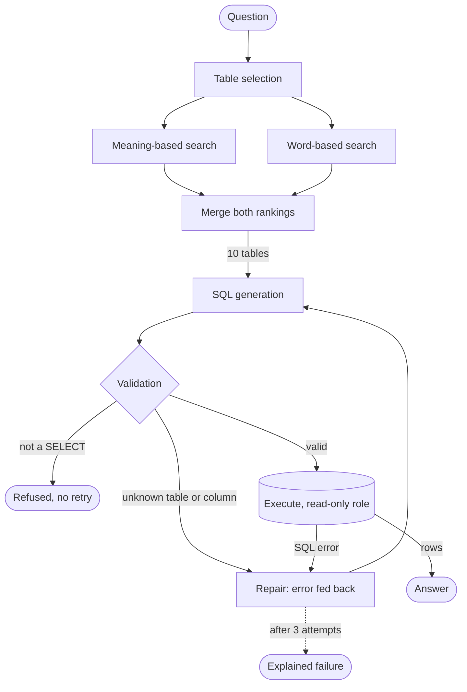

# NL→SQL Agentic Data Assistant

An assistant that answers business questions by generating and executing SQL against
PostgreSQL. Built around schema retrieval, query validation and a correction loop, and
measured at every step against a naive baseline.

Benchmarked on **BIRD Mini-Dev** (PostgreSQL dialect, 500 questions).

## Results

Both runs use the same 500 questions, the same model and the same prompt. The only
difference is what reaches the model and what happens after generation.

| | Baseline | Agent |
|---|---|---|
| Schema sent to the model | all 75 tables | 10 retrieved tables |
| Validation and repair | none | sqlglot + bounded loop |
| **Execution accuracy** | 0.406 | **0.436** |
| Soft F1 | 0.428 | **0.464** |
| SQL execution failures | 56 / 500 | **15 / 500** |
| Input tokens per question | 9,225 | **2,510** |
| Mean latency | 1.09 s | 1.38 s |

By difficulty:

| | Baseline | Agent |
|---|---|---|
| simple (148) | 0.547 | **0.601** |
| moderate (250) | 0.384 | **0.416** |
| challenging (102) | 0.255 | 0.245 |

**Execution accuracy** is the main metric. The generated query and the reference query are
both run against the database, and the answer counts as correct only when the two result
sets are identical. Query text is never compared — two queries written very differently
can both be right, and only the rows they return decide.

**Soft F1** is more forgiving. It compares the two result sets cell by cell instead of all
or nothing, so an answer that gets most values right but misses one, or returns the columns
in a different order, scores partial credit rather than zero. That is why it sits slightly
above execution accuracy on both runs.

### What the numbers say

Retrieval is where the accuracy gain comes from. Cutting 75 tables down to 10 lifts
execution accuracy by 3.8 points while dividing the prompt by 3.8.

The correction loop does something different. It cuts execution failures from 44 to 15 at
equal retrieval, but leaves accuracy flat — it converts queries that crashed into queries
that run and answer the wrong thing. Useful for robustness, not for correctness.

Challenging questions barely move. Whatever limits the system there is neither schema
noise nor malformed SQL.

## The problem

Text-to-SQL demos usually run on toy schemas: five tables, the whole schema pasted into
the prompt, no evaluation.

This benchmark loads 11 unrelated databases — a Czech bank, molecular chemistry, Formula
1, a developer forum, medical records — into a **single PostgreSQL schema**. 75 tables
with no separation, columns named `A2` or `frq_issd`, and dates stored as text in the form
`201308`.

Pasting all of it costs 9,000 tokens per question and buries the two relevant tables under
seventy-three irrelevant ones.

## How it works



### Selecting the right tables

Table names alone are not searchable. Nothing in `atom`, `frq_issd` or `yearmonth` matches
a question about customers and consumption. So each table is described once by an LLM,
from its columns, types and a sample of real values:

> *Monthly fuel consumption per customer. Answers questions about how much a client
> consumed over a given period.*

That description, plus the column names and sample values, is indexed twice.

**Meaning-based search** turns the text into a 1024-dimension vector with `mistral-embed`,
stored in pgvector. A question becomes a vector too, and the closest ones are retrieved.
This finds `yearmonth` for a question about spending even though the word never appears.

**Word-based search** uses PostgreSQL full-text search over the same text. This catches
literal identifiers — a question naming `customerid` matches the table containing it,
which embeddings routinely miss.

The two rankings are merged by **Reciprocal Rank Fusion**: each table scores `1/(60+rank)`
in each ranking, and the scores add up. Working on ranks rather than scores avoids having
to normalise two incomparable scales, and there is no weight to tune. A table ranked well
by both signals rises above one that only excels in a single ranking.

One more step. If retrieval returns `yearmonth` but not `customers`, the model cannot
write the join it needs. So tables connected by a **foreign key** to the retrieved ones are
pulled in as well. This only goes so far here: 35 of the 75 tables declare no foreign key
at all.

### Checking the query before running it

Generated SQL is parsed into a syntax tree by **sqlglot**, then checked against the
catalogue read from the live database: does the table exist, does the column belong to a
table this query actually joins, is the statement a single `SELECT`.

Checks run against the tree rather than the text, because string matching on SQL is
defeated by comments, casing and nesting — a `DELETE` hidden inside a CTE reads as
harmless text.

Failures come back as structured messages:

> *column `link_to_event` does not belong to `expense`; it exists in `budget`*

That specificity is the point. It is what makes the repair prompt actionable rather than a
retry in the dark.

### Repairing

A validation or execution failure sends the query back to the model along with the exact
error. Three attempts maximum — an unbounded loop is how these systems burn a budget on
one malformed question.

A security refusal is terminal. The model is never asked to work around a guardrail.

## Security

Generated SQL is treated as hostile input, with three independent layers:

- a dedicated PostgreSQL role with `SELECT` only, read-only transactions and a 10-second
  statement timeout, set on the role rather than on the connection so application code
  cannot forget them
- syntax-tree checks rejecting anything that is not a single `SELECT`, including writes
  hidden inside a CTE or subquery
- a `LIMIT` injected into every query that lacks one

Measured on real runs: the validator catches 67% of failing queries before execution, with
**zero false positives** — no correct query is ever rejected.

## Stack

| Layer | Choice |
|---|---|
| Orchestration | LangGraph |
| Database and vector store | PostgreSQL 16, pgvector, native full-text search |
| Embeddings | `mistral-embed`, 1024 dimensions |
| Generation | `codestral-2508`, or a local model through Ollama |
| SQL validation | sqlglot |
| API | FastAPI |
| CI | GitHub Actions (ruff, mypy strict, pytest) |

## Getting started

```bash
git clone https://github.com/yaichm/nl2sql-agent && cd nl2sql-agent
cp .env.example .env        # add MISTRAL_API_KEY
make install
docker compose up -d
```

Load the benchmark databases, then build the search index:

```bash
# download BIRD Mini-Dev (PostgreSQL) into data/raw/, then
docker compose exec -T postgres psql -U postgres -d nl2sql \
  < data/raw/MINIDEV_postgresql/BIRD_dev.sql

uv run nl2sql describe      # one LLM description per table, cached to disk
uv run nl2sql index         # embed and index the catalogue
```

The `role "xiaolongli" does not exist` errors during the load are expected — they are
ownership statements from the dump and have no effect on the data.

### Running it

```bash
uv run nl2sql search "how much did customer 6 consume in 2013"   # inspect retrieval
uv run nl2sql run --mode baseline --n 500 --tag baseline
uv run nl2sql run --mode agent --n 500 --tag agent
uv run nl2sql analyse --tags baseline agent
```

`run` generates predictions and evaluates them. The two steps are separate on purpose:
`predictions-*.json` holds everything the evaluation needs, including the reference query
and its result, so metrics can be recomputed without paying for the API again.

A web UI is served at `http://localhost:8000`:

```bash
uv run uvicorn nl2sql_agent.api.app:app --reload
```

## Evaluation

Execution accuracy follows the official BIRD implementation: the two result sets are
compared as sets, so row order is ignored, duplicates collapse, and values must match
exactly. Soft F1 is implemented positionally, as in the reference code.

Beyond those two, each run reports where questions fail — `correct`, `wrong_result`,
`sql_error`, `gold_failed` — because a query that crashes and a query that answers the
wrong thing call for opposite fixes.

Every configuration is a separate run with a fixed seed, so two runs compare the same
questions. Reports land in `reports/<tag>/`.

## Data

BIRD Mini-Dev is published under CC BY-SA 4.0. The data is not redistributed here; the
setup steps download it from the official source.

Li et al., *Can LLM Already Serve as a Database Interface? A Big Bench for Large-Scale
Database Grounded Text-to-SQLs*, NeurIPS 2023 — https://bird-bench.github.io/